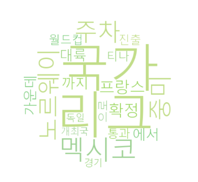

# 자연어 텍스트 데이터 전처리 프로젝트

## 프로젝트 개요

뉴스 기사를 수집하여 한국어 자연어 처리(NLP) 파이프라인을 구축하고, PyTorch Tensor 변환 및 워드클라우드 시각화를 수행한 프로젝트입니다.

---

## 수집 기사

**제목:** 한국 포함 25팀 남았다...2주차 32강 확정은 '7개국', '유럽' 독일-프랑스-노르웨이 막강, '남미' 아르헨티나-콜롬비아 눈길

**출처:** 네이버 스포츠 (마이데일리)

**URL:** https://m.sports.naver.com/fifaworldcup2026/article/117/0004078155

---

## 처리 과정

### 1. 텍스트 수집
- `requests`와 `BeautifulSoup`을 사용하여 네이버 스포츠 뉴스 기사 본문 크롤링
- 수집한 텍스트를 `data/news_article.txt`에 저장

### 2. 텍스트 정제
- 정규표현식(`re`)을 사용하여 한글과 공백을 제외한 모든 문자 제거
- 여러 개의 공백을 하나로 정리

### 3. 형태소 분석
- KoNLPy의 `Kkma` 형태소 분석기를 사용하여 품사 태깅(POS Tagging) 수행
- 분석 결과: `(단어, 품사)` 형태로 출력

### 4. 불용어 제거
- 뉴스 기사 특성상 의미 없는 단어 제거
- 불용어 목록: `게티이미지코리아`, `마이데일리`, `기자`, `데일리`, `마이`
- 한 글자 이하 단어 추가 제거

### 5. 단어 빈도 계산
- 단어를 숫자 ID로 변환하여 vocabulary 구성
- `torch.bincount()`를 활용하여 단어 빈도 계산

### 6. PyTorch Tensor 변환
- 단어 ID 리스트를 `torch.tensor()`로 변환 (`dtype=torch.long`)
- PyTorch 기반으로 단어 빈도 행렬 구성

### 7. 워드클라우드 생성 및 상위 20개 단어 시각화
- 상위 20개 단어를 워드클라우드로 시각화
- 원형 마스크 적용 (`images/circle.png`)
- 연한 초록~연두 계열 컬러 적용

---

## 상위 20개 단어 빈도

| 순위 | 단어 | 빈도 |
|------|------|------|
| 1 | 국가 | 5 |
| 2 | 리그 | 5 |
| 3 | 멕시코 | 5 |
| 4 | 노르웨이 | 4 |
| 5 | 주차 | 4 |
| 6 | 중미 | 4 |
| 7 | 프랑스 | 4 |
| 8 | 확정 | 4 |
| 9 | 가운데 | 3 |
| 10 | 까지 | 3 |
| 11 | 대륙 | 3 |
| 12 | 에서 | 3 |
| 13 | 월드컵 | 3 |
| 14 | 으로 | 3 |
| 15 | 진출 | 3 |
| 16 | 통과 | 3 |
| 17 | 티나 | 3 |
| 18 | 개최국 | 2 |
| 19 | 경기 | 2 |
| 20 | 독일 | 2 |

---

## 워드클라우드 시각화



---

## 결과 분석

- 가장 높은 빈도를 보인 단어는 **국가, 리그, 멕시코** (각 5회)로, 기사가 2026 북중미 월드컵 조별리그 국가별 현황을 다루고 있음을 반영합니다.
- **노르웨이, 프랑스, 중미, 주차, 확정** (각 4회)이 뒤를 이어, 유럽 강팀과 개최국 지역 관련 내용이 핵심임을 알 수 있습니다.
- **월드컵, 진출, 통과, 대륙** 등의 단어가 반복 등장하여 32강 진출 확정 관련 내용이 주요 주제임을 확인할 수 있습니다.
- 불용어 제거 후에도 **에서, 으로, 까지** 등 조사가 포함되어 있어, 추후 품사 필터링(명사만 추출)을 적용하면 더 의미 있는 분석이 가능할 것으로 보입니다.

---

## 사용 라이브러리

| 라이브러리 | 용도 |
|------------|------|
| requests | 웹 크롤링 |
| BeautifulSoup | HTML 파싱 |
| re | 정규표현식 텍스트 정제 |
| konlpy (Kkma) | 한국어 형태소 분석 |
| torch | 단어 Tensor 변환 및 빈도 계산 |
| wordcloud | 워드클라우드 생성 |
| matplotlib | 시각화 |
| pandas | 데이터 처리 |
| PIL | 마스크 이미지 처리 |

---

## 프로젝트 구조

```
test_konlpy_project/
├── data/
│   └── news_article.txt
├── fonts/
│   └── malgunsl.ttf
├── images/
│   ├── circle.png
│   └── heart.png
├── konlpy_practice_project.py
└── README.md
```